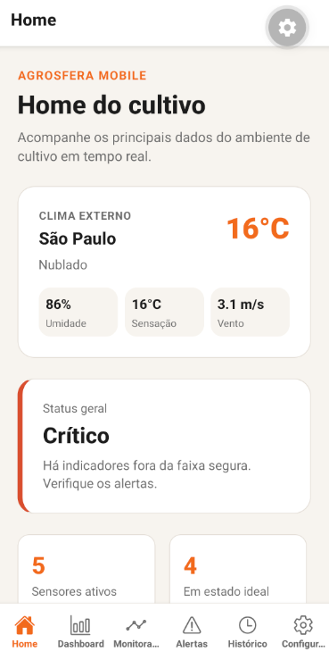
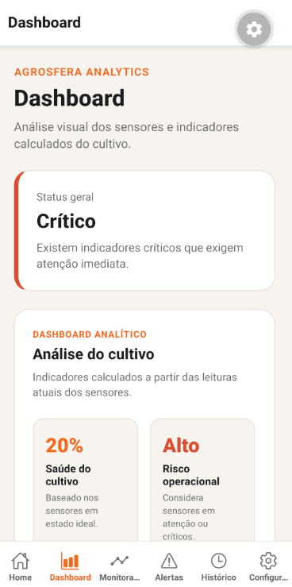
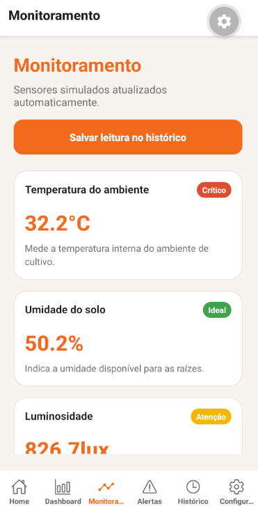
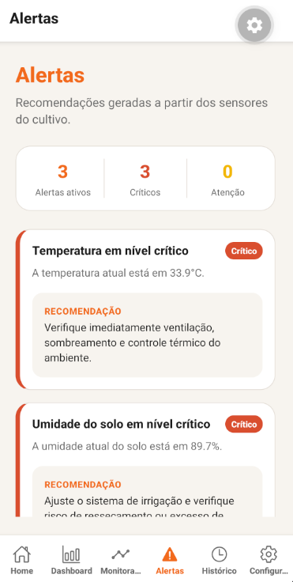
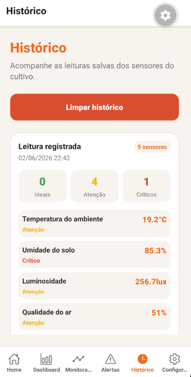
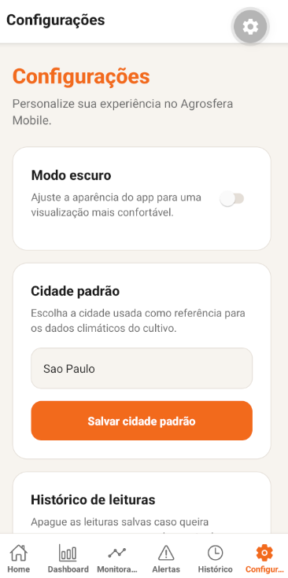
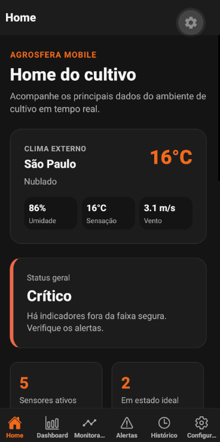
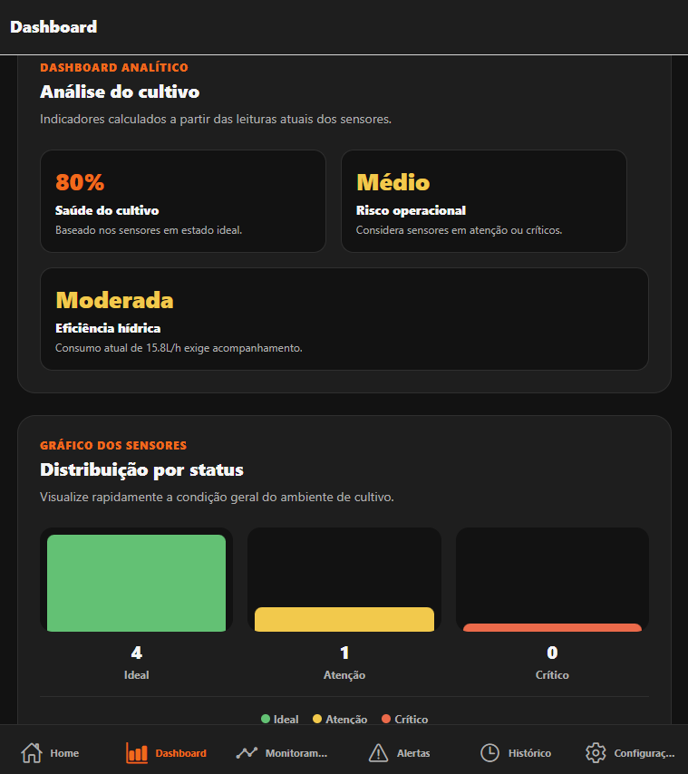
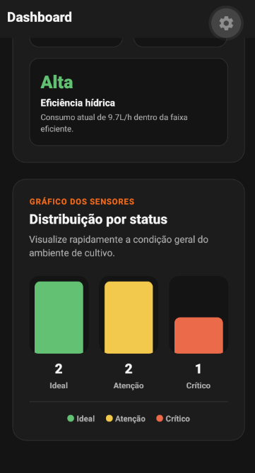

# 🌱 Agrosfera Mobile — Agricultura Inteligente Conectada ao Espaço

## 👥 Integrantes

| Nome         | RM       |
| ------------ | -------- |
| Caio Freitas | RM553190 |
| Caio Hideki  | RM553630 |
| Jorge Booz   | RM552700 |
| Mateus Tibão | RM553267 |
| Lana Andrade | RM552596 |

---

## 📋 Descrição do Problema

A produção de alimentos em ambientes extremos, como bases lunares, estações espaciais ou regiões remotas da Terra, exige controle preciso de recursos como água, temperatura, luminosidade, qualidade do ar e energia.

Na Terra, desafios semelhantes aparecem em estufas inteligentes, agricultura urbana, regiões com escassez hídrica e ambientes de cultivo controlado. Pequenas variações ambientais podem afetar diretamente a produtividade, o desperdício de recursos e a saúde das plantas.

Diante desse cenário, surge a necessidade de uma solução mobile capaz de acompanhar dados ambientais, exibir alertas, apoiar decisões e tornar o monitoramento agrícola mais acessível, visual e eficiente.

---

## 💡 Solução Proposta: Agrosfera Mobile

O **Agrosfera Mobile** é um aplicativo desenvolvido em **React Native com Expo SDK 55 e TypeScript**, voltado ao monitoramento inteligente de ambientes de cultivo controlado.

A solução combina dados climáticos reais, sensores inteligentes simulados, histórico de leituras, alertas de risco, dashboard analítico e uma conexão conceitual com a indústria espacial por meio da NASA APOD.

O app foi pensado para demonstrar como tecnologias inspiradas por ambientes extremos podem gerar impacto positivo na Terra, apoiando uma agricultura mais sustentável, eficiente e orientada por dados.

---

## 🛰️ Relação com a Global Solution / Space Connect

O projeto está alinhado ao tema da **economia espacial**, explorando a ideia de que soluções criadas para ambientes restritivos, como bases lunares ou habitats em Marte, podem inspirar aplicações úteis na Terra.

No contexto do Agrosfera, o desafio espacial relacionado à produção eficiente de alimentos em ambientes fechados foi traduzido para uma solução mobile aplicada a:

* Agricultura urbana
* Estufas inteligentes
* Cultivo controlado
* Sustentabilidade
* Redução de desperdício hídrico
* Monitoramento ambiental
* Uso inteligente de dados

A proposta segue a lógica de que quanto mais difícil o ambiente, mais eficientes precisam ser as soluções.

---

## 🎯 Objetivos do Agrosfera Mobile

* Monitorar dados ambientais de um cultivo controlado
* Consumir dados climáticos reais via OpenWeather
* Simular sensores inteligentes de cultivo
* Gerar alertas e recomendações para o usuário
* Salvar leituras no histórico do app
* Permitir personalização com modo claro e escuro
* Exibir conteúdo espacial diário com NASA APOD
* Criar uma experiência moderna, funcional e responsiva
* Exibir indicadores analíticos sobre a saúde do cultivo
* Demonstrar boas práticas de arquitetura mobile

---

## 🧭 Sistema de Navegação

O Agrosfera Mobile utiliza uma navegação híbrida com **Native Stack Navigator** e **Bottom Tab Navigator**.

A estrutura principal utiliza Stack Navigation para organizar a aplicação e Bottom Tabs para permitir acesso rápido às áreas principais do app.

| Aba              | Função                                                                         |
| ---------------- | ------------------------------------------------------------------------------ |
| 🏠 Home          | Visão operacional com status geral, clima externo, sensores ativos e NASA APOD |
| 📊 Dashboard     | Análise do cultivo com indicadores calculados e gráfico dos sensores           |
| 📡 Monitoramento | Lista de sensores inteligentes simulados                                       |
| ⚠️ Alertas       | Recomendações geradas com base nos sensores                                    |
| 🕘 Histórico     | Leituras salvas para acompanhamento posterior                                  |
| ⚙️ Configurações | Tema, cidade padrão, histórico e informações do app                            |

---

## 💻 Tecnologias Utilizadas

| Tecnologia       | Finalidade                                        |
| ---------------- | ------------------------------------------------- |
| React Native     | Framework principal do app                        |
| Expo SDK 55      | Ambiente de desenvolvimento e execução            |
| TypeScript       | Tipagem estática e segurança no código            |
| React Navigation | Navegação entre telas                             |
| Native Stack     | Estrutura de navegação principal                  |
| Bottom Tabs      | Navegação principal por abas                      |
| Axios            | Consumo de APIs externas                          |
| AsyncStorage     | Armazenamento interno de preferências e histórico |
| Context API      | Controle global de tema                           |
| Custom Hooks     | Reutilização de lógicas de carregamento e tela    |
| OpenWeather API  | Dados climáticos reais                            |
| NASA APOD API    | Conteúdo espacial diário                          |
| Ionicons         | Ícones da navegação                               |
| Animated API     | Animações suaves e microinterações                |

---

## 📁 Estrutura do Projeto

```text
AgrosferaMobile/
├── src/
│   ├── assets/
│   ├── components/
│   │   ├── AnimatedPressable.tsx
│   │   ├── CultivationAnalytics.tsx
│   │   ├── DashboardSkeleton.tsx
│   │   ├── FadeInView.tsx
│   │   ├── ListSkeleton.tsx
│   │   ├── LoadingScreen.tsx
│   │   ├── SensorStatusChart.tsx
│   │   └── SkeletonBox.tsx
│   ├── contexts/
│   │   └── ThemeContext.tsx
│   ├── hooks/
│   │   └── useScreenLoading.ts
│   ├── navigation/
│   │   └── AppNavigator.tsx
│   ├── screens/
│   │   ├── HomeScreen.tsx
│   │   ├── DashboardScreen.tsx
│   │   ├── MonitoringScreen.tsx
│   │   ├── AlertsScreen.tsx
│   │   ├── HistoryScreen.tsx
│   │   └── SettingsScreen.tsx
│   ├── services/
│   │   ├── sensorService.ts
│   │   ├── alertService.ts
│   │   ├── weatherService.ts
│   │   └── nasaService.ts
│   ├── storage/
│   │   ├── historyStorage.ts
│   │   └── preferencesStorage.ts
│   ├── theme/
│   │   ├── colors.ts
│   │   ├── theme.ts
│   │   └── index.ts
│   ├── types/
│   │   ├── alert.ts
│   │   ├── history.ts
│   │   ├── nasa.ts
│   │   ├── navigation.ts
│   │   ├── sensor.ts
│   │   └── weather.ts
│   └── utils/
│       └── status.ts
├── assets/
│   └── screenshots/
├── App.tsx
├── package.json
├── tsconfig.json
└── README.md
```

---

## 🎯 Funcionalidades Implementadas

### ✅ Home

* Status geral do cultivo
* Cards com resumo dos sensores ativos
* Dados climáticos reais da cidade padrão
* Temperatura, umidade, sensação térmica e vento
* Indicadores principais do ambiente
* Card com inspiração espacial diária usando NASA APOD
* Skeleton loading ao abrir a tela
* Animações suaves de entrada dos blocos

---

### ✅ Dashboard

* Status geral do cultivo
* Dashboard analítico com indicadores calculados
* Índice de saúde do cultivo
* Risco operacional
* Eficiência hídrica
* Gráfico de barras com distribuição dos sensores por status
* Indicadores visuais para sensores ideais, em atenção e críticos
* Animações suaves nos cards e no gráfico

---

### ✅ Monitoramento

* Sensores inteligentes simulados
* Atualização automática dos dados
* Exibição de valor, unidade e status
* Status classificados como:

  * Ideal
  * Atenção
  * Crítico
* Botão para salvar leitura no histórico
* Interface em cards modernos e responsivos
* Skeleton loading de lista
* Feedback visual ao pressionar botões

---

### ✅ Alertas

* Alertas gerados com base nos sensores
* Recomendações para cada tipo de risco
* Classificação por severidade
* Resumo de alertas ativos
* Estado vazio quando não há problemas detectados
* Skeleton loading de lista
* Animações suaves nos cards
* Linguagem voltada para usuário comum

---

### ✅ Histórico

* Leituras salvas para acompanhamento posterior
* Resumo por leitura registrada
* Quantidade de sensores ideais, em atenção e críticos
* Listagem detalhada dos sensores salvos
* Opção para limpar histórico
* Dados mantidos mesmo após fechar o app
* Skeleton loading de lista
* Animações suaves nos registros
* Feedback visual no botão de limpeza

---

### ✅ Configurações

* Alternância entre modo claro e escuro
* Preferência visual salva
* Cadastro de cidade padrão para clima
* Limpeza do histórico de leituras
* Informações sobre o app
* Comunicação amigável, sem expor termos técnicos ao usuário final
* Feedback visual em ações importantes

---

### ✅ APIs Externas

#### OpenWeather

Utilizada para buscar dados climáticos reais da cidade padrão configurada pelo usuário.

Dados exibidos:

* Cidade
* Temperatura
* Sensação térmica
* Umidade
* Velocidade do vento
* Condição climática

#### NASA APOD

Utilizada como diferencial criativo para reforçar a conexão com a indústria espacial.

Dados exibidos:

* Imagem astronômica do dia
* Título
* Data
* Descrição resumida

---

## 📊 Dashboard Analítico

O app possui uma área de análise dedicada para transformar os dados dos sensores em indicadores úteis para tomada de decisão.

Indicadores calculados:

| Indicador            | Descrição                                                              |
| -------------------- | ---------------------------------------------------------------------- |
| Saúde do cultivo     | Percentual baseado na quantidade de sensores em estado ideal           |
| Risco operacional    | Classificação baseada na existência de sensores em atenção ou críticos |
| Eficiência hídrica   | Avaliação do consumo de água do ambiente de cultivo                    |
| Gráfico dos sensores | Distribuição visual entre Ideal, Atenção e Crítico                     |

Essa área reforça a proposta de monitoramento inteligente e aproxima o app de uma solução analítica voltada à agricultura sustentável.

---

## 🏗️ Arquitetura Técnica

O projeto foi organizado com separação clara de responsabilidades:

* **screens**: telas principais do aplicativo
* **components**: componentes reutilizáveis
* **services**: consumo de APIs e geração de dados simulados
* **storage**: controle das informações salvas no app
* **contexts**: estado global, como tema claro/escuro
* **hooks**: lógicas reutilizáveis
* **types**: tipagens TypeScript
* **theme**: design system e cores
* **utils**: funções auxiliares

Essa organização facilita manutenção, leitura do código e evolução do projeto.

---

## 🧠 Conceitos Aplicados

| Conceito         | Aplicação no projeto                                              |
| ---------------- | ----------------------------------------------------------------- |
| Componentes      | Cards, skeletons, gráfico, botões animados e blocos reutilizáveis |
| Props            | Componentes recebem dados e configurações de exibição             |
| State            | Controle de sensores, clima, APOD, histórico, tema e preferências |
| Hooks            | Uso de hooks nativos e hooks customizados                         |
| FlatList         | Listagens de sensores, alertas e histórico                        |
| ScrollView       | Telas com conteúdo analítico e operacional                        |
| TypeScript       | Tipagem forte em dados, navegação e serviços                      |
| Interfaces       | Modelagem de sensores, clima, alertas, NASA e histórico           |
| Types            | Status, tipos de sensores, tema e navegação                       |
| Generics         | Uso em states, Axios e navegação tipada                           |
| Service Layer    | Separação das integrações e regras de dados                       |
| AsyncStorage     | Histórico, tema e cidade padrão                                   |
| Context API      | Tema global                                                       |
| React Navigation | Stack Navigation e Tab Navigation tipadas                         |

---

## 🎨 UX/UI

A interface do Agrosfera Mobile foi criada com foco em clareza, contraste e leitura rápida dos dados.

A identidade visual utiliza:

* **Laranja vibrante** para ações e destaques
* **Laranja claro** como apoio visual
* **Marrom escuro** para profundidade e conexão com o tema agrícola
* **Tons claros e escuros** para suporte ao modo claro e escuro
* **Cards arredondados** para organizar informações
* **Badges de status** para leitura rápida
* **Skeleton loading** nas telas principais
* **Gráfico de barras** para status dos sensores
* **Animações suaves** com fade-in e pulso visual
* **Microinterações** em botões e controles
* **Feedback visual** em ações, estados e alertas
* **Dark/light mode** aplicado globalmente

A comunicação do app foi pensada para usuários comuns, evitando termos técnicos na interface.

---

## 📸 Screenshots

| Home                                   | Dashboard                                        | Monitoramento                                            |
| -------------------------------------- | ------------------------------------------------ | -------------------------------------------------------- |
|  |  |  |

| Alertas                                      | Histórico                                        | Configurações                                            |
| -------------------------------------------- | ------------------------------------------------ | -------------------------------------------------------- |
|  |  |  |

| Modo Escuro                                          | Web                                  | Gráfico                                      |
| ---------------------------------------------------- | ------------------------------------ | -------------------------------------------- |
|  |  |  |

---

## 🔄 Fluxo do Aplicativo

```text
Usuário abre o app
        ↓
Loading inicial
        ↓
Home
        ↓
Consulta clima externo pela OpenWeather
        ↓
Exibe sensores simulados do cultivo
        ↓
Usuário acessa o Dashboard
        ↓
Visualiza análise do cultivo e gráfico dos sensores
        ↓
Alertas são gerados com base nos sensores
        ↓
Usuário pode salvar leituras no histórico
        ↓
Usuário pode ajustar tema e cidade padrão nas configurações
```

---

## 📊 Diagrama Simplificado

```text
┌──────────────────────┐
│   Agrosfera Mobile   │
└──────────┬───────────┘
           │
           ▼
┌──────────────────────┐
│        Home          │
│ Clima + Sensores     │
│ NASA APOD            │
└──────────┬───────────┘
           │
           ▼
┌──────────────────────┐
│      Dashboard       │
│ Análise + Gráfico    │
└──────────┬───────────┘
           │
 ┌─────────┼─────────┬─────────────┬──────────────┐
 ▼         ▼         ▼             ▼              ▼
Monitor.  Alertas   Histórico     Config.        APIs
Sensores  Riscos    Leituras      Tema/Cidade    OpenWeather
simulados Recom.    salvas        Preferências   NASA APOD
```

---

## 🚀 Como Executar o Projeto

### Pré-requisitos

* Node.js instalado
* npm instalado
* Expo Go no celular ou Android Emulator configurado
* Conta e API key da OpenWeather

---

### Passos

Clone o repositório:

```bash
git clone https://github.com/jorgebooz/Agrosfera-Mobile
```

Acesse a pasta do projeto:

```bash
cd Agrosfera-Mobile
```

Instale as dependências:

```bash
npm install
```

Crie o arquivo `.env` na raiz do projeto:

```env
EXPO_PUBLIC_OPENWEATHER_API_KEY=SUA_CHAVE_OPENWEATHER_AQUI
EXPO_PUBLIC_DEFAULT_CITY=Sao Paulo,BR
EXPO_PUBLIC_NASA_API_KEY=DEMO_KEY
```

Execute o projeto:

```bash
npx expo start
```

Para abrir no Android:

```text
Pressione a tecla "a" no terminal do Expo
```

Para abrir na Web:

```text
Pressione a tecla "w" no terminal do Expo
```

Ou escaneie o QR Code com o aplicativo Expo Go.

---

## ⚙️ Dependências Principais

```json
{
  "expo": "SDK 55",
  "react-native": "React Native via Expo",
  "typescript": "TypeScript",
  "@react-navigation/native": "Navegação",
  "@react-navigation/bottom-tabs": "Abas inferiores",
  "@react-navigation/native-stack": "Navegação em pilha",
  "@react-native-async-storage/async-storage": "Armazenamento interno",
  "axios": "Consumo de APIs",
  "@expo/vector-icons": "Ícones"
}
```

---

## 📌 Observações da Entrega

* O projeto não contém `node_modules` no repositório.
* O arquivo `.env` não deve ser enviado ao GitHub.
* A chave da OpenWeather deve ser criada individualmente por quem executar o projeto.
* A NASA APOD utiliza `DEMO_KEY` por padrão, podendo ser substituída por uma chave real.
* Os sensores do cultivo são simulados para representar o comportamento de dispositivos IoT.
* Android e Web foram testados durante o desenvolvimento.
* iOS é compatível via Expo Go, mas não foi validado nesta entrega por instabilidade de conexão.
* O app foi desenvolvido com foco acadêmico, funcional e demonstrativo.

---

## 📄 Licença

Projeto acadêmico desenvolvido para a **FIAP — Global Solution 2025**.

---

## 🔗 Repositório

[GitHub — Agrosfera Mobile](https://github.com/jorgebooz/Agrosfera-Mobile)
